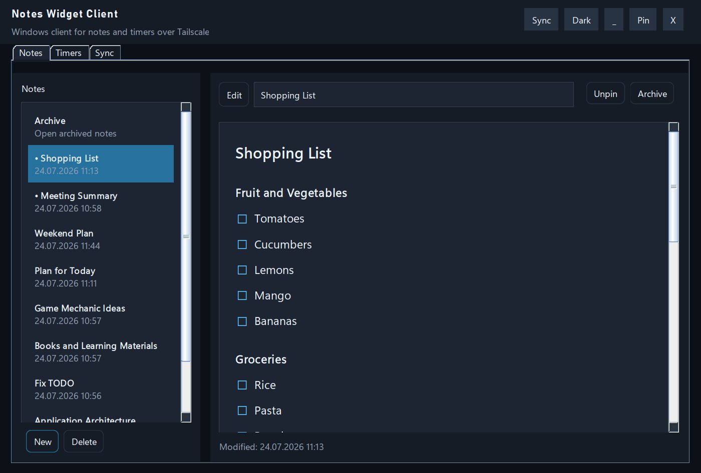
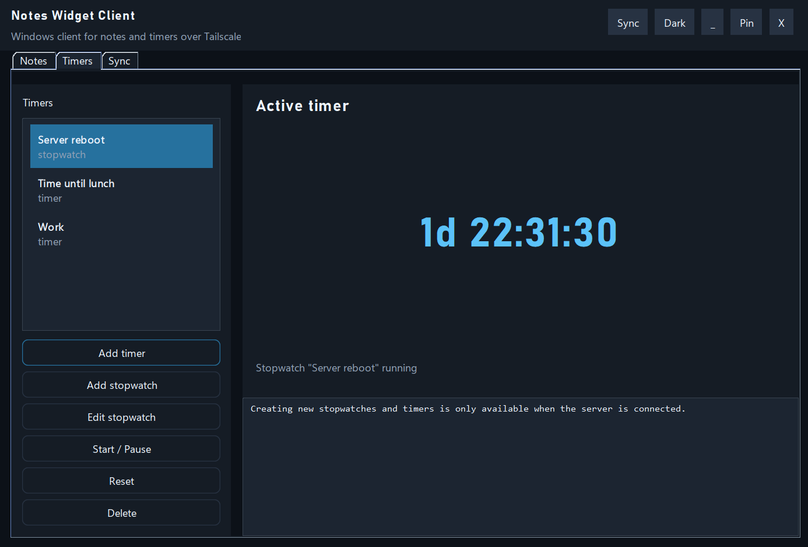
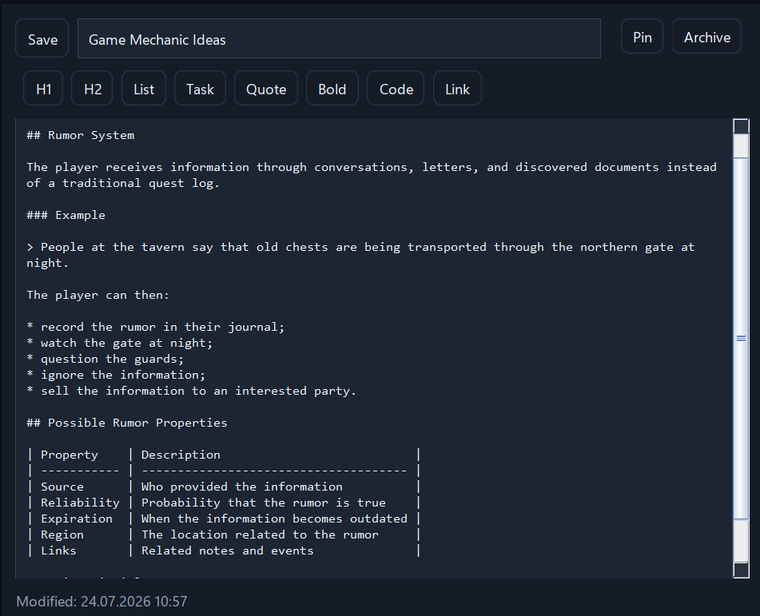
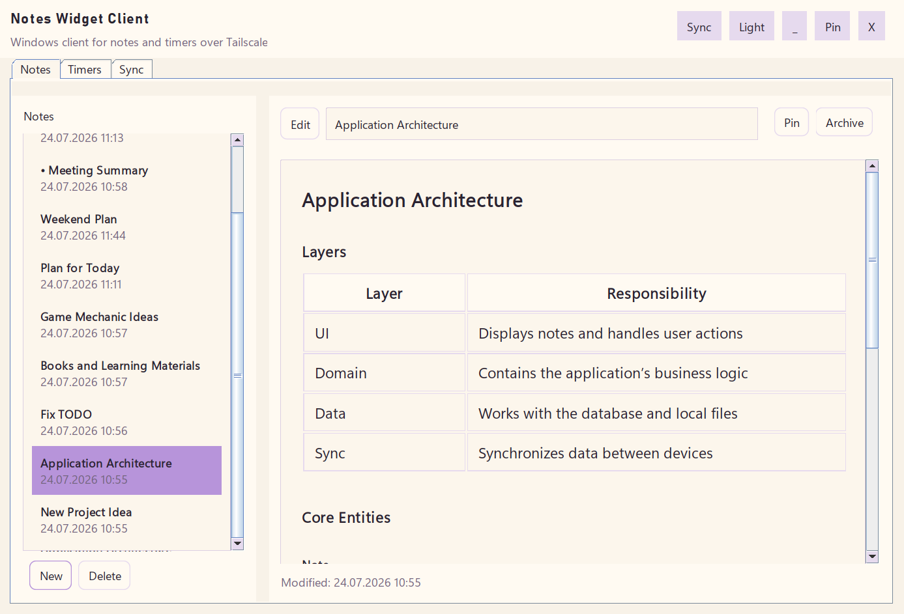
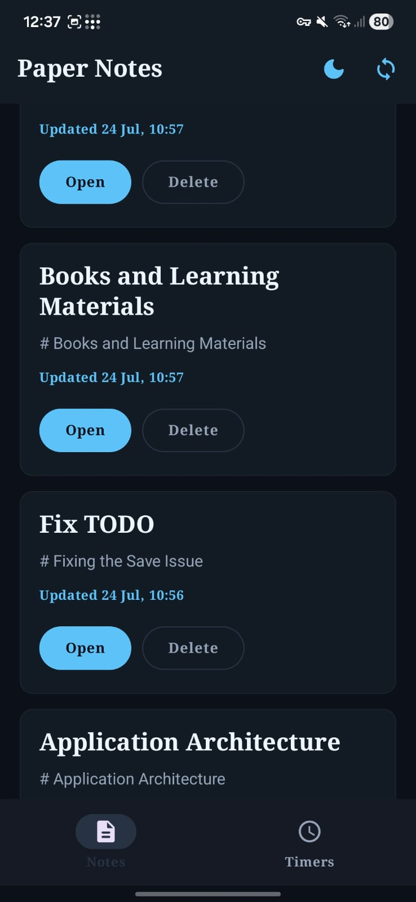
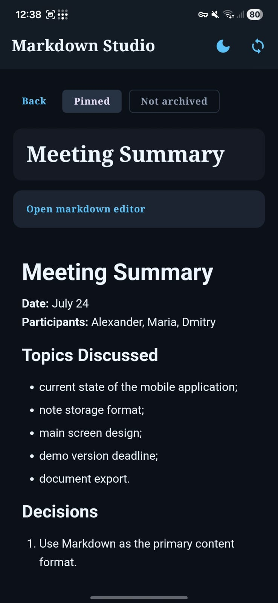
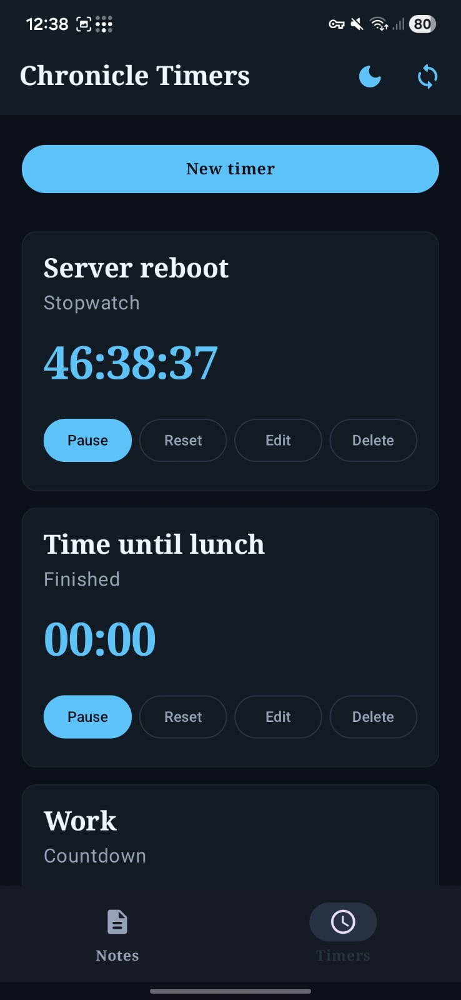
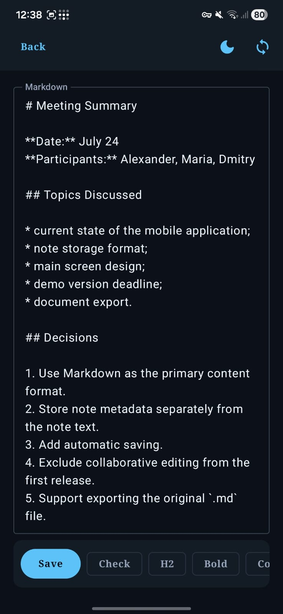
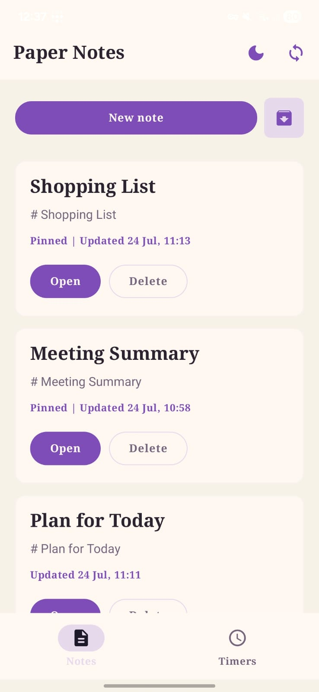

# Notes Desktop

Standalone Windows desktop client project for notes and timers. Works with [server](https://github.com/ImMedved/Notes-server). App has [Android version](https://github.com/ImMedved/Notes-android), that can be synced with desktop via server.

## Table of contents
* [1. Screenshots](#Screenshots)
* [2. Contents](#Contents)
* [3. Build/Run](#Build)
* [4. TODO](#TODO)

## Screenshots

### View all notes



### View all timers and stopwatches



### Markdown editor



### Light theme



## Android Screenshots

### View all notes



### Note preview



### View all timers and stopwatches



### Markdown editor



### Light theme



## Contents

- Java 17 desktop widget
- Local config and cache storage
- HTTP client for Server
- jpackage build script for Windows app-image

## Build

```powershell
mvn -q -DskipTests package
```

### Build EXE

Windows only:

```powershell
powershell -ExecutionPolicy Bypass -File .\build-exe.ps1
```

Output:

- `dist\NotesWidgetClient\NotesWidgetClient.exe`

### First local run

By default the client points to:

- server URL: `http://127.0.0.1:8080`
- API key: `change-me`

API key is used for switching users. Each user has their own key. There is no security in the app, any key can be obtained by brute force and will give access to all data.

## TODO

- [ ] Documentation
- [ ] Java 25 migration
- [ ] Images support
- [ ] Real-time synchronization
- [ ] Auth